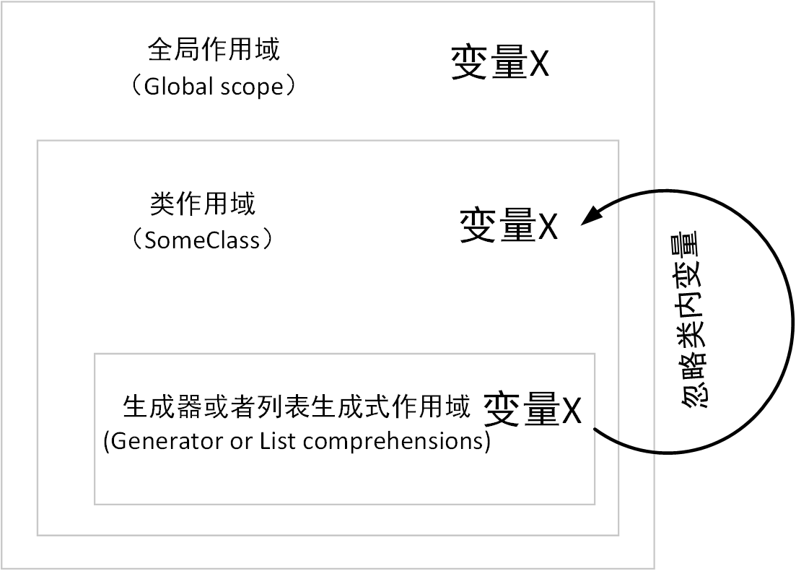

<p align="center"></p>

<h1 align="center">疯狂的Python! 🐍</h1>
<p align="center">一些有趣的鲜为人知的Python特性集合.</p>

[](http://www.wtfpl.net/)
[](https://gitter.im/Crazy-Python/Lobby?utm_source=badge&utm_medium=badge&utm_campaign=pr-badge&utm_content=badge)


*本文翻译自[What the f*ck Python!](https://github.com/satwikkansal/wtfpython)*

---

Python作为一个设计优美的交互式脚本语言，提供了许多人性化的语法。但是也因为这个原因，有些Python的代码片段并不会按照用户想象的那样运行。

这篇文章就让我们总结一下那些Python里反直觉的代码片段，并且深入研究一下其中的运行原理。

下面的某些例子可能并不像是标题说的那样....嗯....反直觉，但是它们依旧会带你揭示一些你从来没有意识到的Python语言特性。

而且，我发现这也是一种很好的学习编程语言的方法，不过前提是你不要认为这篇文章会告诉你一切，抛砖引玉而已。相信我，你需要的知识都隐藏在互联网的某个角落里。

如果你已经写了很久的Python代码，你可以把下面的这些例子当做一个挑战，试一试自己能不能在第一次就猜对结果。也许某些例子里的坑你已经遇到过并且解决了，那么再次看见这个坑的时候我想你会为当时自己的努力而自豪的。:sweat_smile:

好了，下面是正文！

<h1>目录</h1>
<!-- TOC depthFrom:1 depthTo:3 -->

- [示例结构说明](#示例结构说明)
- [使用方法](#使用方法)
- [:eyes: 例子](#eyes-例子)
    - [第一章: 撕裂大脑](#第一章-撕裂大脑)
        - [▶ 善变的字符串 *](#▶-善变的字符串-)
        - [▶ 不变的哈希值](#▶-不变的哈希值)
        - [▶ 说了要执行就一定会执行！](#▶-说了要执行就一定会执行)
        - [▶ 鸠占鹊巢 *](#▶-鸠占鹊巢-)
        - [▶ 神奇赋值法](#▶-神奇赋值法)
        - [▶ 时间的误会](#▶-时间的误会)
        - [▶ 特殊的数字们](#▶-特殊的数字们)
        - [▶ 三子棋之一步取胜法](#▶-三子棋之一步取胜法)
        - [▶ 没脑子的函数](#▶-没脑子的函数)
        - [▶ `is not ...` 并不是  `is (not ...)`](#▶-is-not--并不是--is-not-)
        - [▶ 尾部的逗号](#▶-尾部的逗号)
        - [▶ 最后一个反斜杠](#▶-最后一个反斜杠)
        - [▶ 纠结的not](#▶-纠结的not)
        - [▶ 只剩一半的三引号](#▶-只剩一半的三引号)
        - [▶ 消失的午夜零点](#▶-消失的午夜零点)
        - [▶ 站错队的布尔型](#▶-站错队的布尔型)
        - [▶ 类属性与类实例属性](#▶-类属性与类实例属性)
        - [▶ None的产生](#▶-none的产生)
        - [▶ 不可修改的元组](#▶-不可修改的元组)
        - [▶ 消失的变量e](#▶-消失的变量e)
        - [▶ 亦真还假](#▶-亦真还假)
        - [▶ 转瞬即空](#▶-转瞬即空)
        - [▶ 子类的关系 *](#▶-子类的关系-)
        - [▶ 神秘的键值转换 *](#▶-神秘的键值转换-)
        - [▶ 看你能不能猜到这个的结果？](#▶-看你能不能猜到这个的结果)
    - [第二章: 瞒天过海](#第二章-瞒天过海)
        - [▶ 无效的一行？](#▶-无效的一行)
        - [▶ 移形换位 *](#▶-移形换位-)
        - [▶ 到底哪里出错了呢？](#▶-到底哪里出错了呢)
    - [第三章: 隐藏的陷阱](#第三章-隐藏的陷阱)
        - [▶ 不要在迭代一个字典的时候修改这个字典！](#▶-不要在迭代一个字典的时候修改这个字典)
        - [▶ 删不掉的对象 *](#▶-删不掉的对象-)
        - [▶ 删除正在迭代中的列表项](#▶-删除正在迭代中的列表项)
        - [▶ 被泄露出去的循环变量!](#▶-被泄露出去的循环变量)
        - [▶ 小心那些有默认值的可变参数!](#▶-小心那些有默认值的可变参数)
        - [▶ 抓住这些异常！](#▶-抓住这些异常)
        - [▶ 相同的操作，不同的结果](#▶-相同的操作不同的结果)
        - [▶ 作用域之外的变量](#▶-作用域之外的变量)
        - [▶ 小心那些链式操作符](#▶-小心那些链式操作符)
        - [▶ 被忽略的类变量](#▶-被忽略的类变量)
        - [▶ 小心处理元组](#▶-小心处理元组)
    - [第四章: 一起来找些有趣的东西！](#第四章-一起来找些有趣的东西)
        - [▶ 人生苦短，我用Python *](#▶-人生苦短我用python-)
        - [▶ 为什么要用`goto`？ *](#▶-为什么要用goto-)
        - [▶ 试试用大括号？ *](#▶-试试用大括号-)
        - [▶ 不等号的争议 *](#▶-不等号的争议-)
        - [▶ 就算Python也知道爱是个复杂的东西 *](#▶-就算python也知道爱是个复杂的东西-)
        - [▶ 这些语句是存在的！](#▶-这些语句是存在的)
        - [▶ 无限(Inpinity) *](#▶-无限inpinity-)
        - [▶ 被修改的类成员 *](#▶-被修改的类成员-)
    - [第五章: 杂项](#第五章-杂项)
        - [▶ `+=`更快](#▶-更快)
        - [▶ 超长字符串!](#▶-超长字符串)
        - [▶ 字符串到浮点数的转换](#▶-字符串到浮点数的转换)
        - [▶ 最后一些小特点集合](#▶-最后一些小特点集合)
- [贡献](#贡献)
- [感谢](#感谢)
- [:mortar_board: 版权声明](#mortar_board-版权声明)
    - [帮助](#帮助)
    - [关于pdf出版的问题](#关于pdf出版的问题)

<!-- /TOC -->

# 示例结构说明


下面是每个例子里通用的结构说明：

> ### ▶ 这里是例子的标题 *
> 首先是例子的标题，如果某个标题后面带有星号，说明这是一个新加入的例子。
> ```py
> # 第一个代码段里面会有一些初始化代码
> # 为后续的输出代码段做准备...
> ```
>
> **Output (Python version):**
> ```py
> >>> python语句，执行某个命令
> 一些输出（可能你想得到，也可能想不到）
> ```
> (可选): 有可能会说明一下上面输出的内容
>
>
> #### 💡 解释:
>
> * 简短的介绍发生了什么和为什么会产生这些输出。
>   ```py
>   一些初始化代码
>   ```
>   **Output:**
>   ```py
>   >>> 执行代码 # 这些代码会展示为何会有上方那些输出内容
>   ```

**注意：** 所有的代码都是在 Python 3.5.2 环境下测试通过，理论上如果没有特殊声明，可以在所有的Python版本下运行。

# 使用方法

在我看来，为了充分的利用这个仓库里的所有例子，最好的办法就是按照顺序把每个例子挨个看一遍：
- 仔细阅读每个例子的初始化代码。如果你是一个经验丰富的Python程序员，那么大部分时候你都可以知道初始化代码执行后具体会发生什么。
- 阅读输出结果并且，
    + 检查输出结果是否和你想的一样
    + 确认你是否知道产生这种结果背后的原理，
        - 如果不知道，那么请仔细阅读解释章节（如果看完解释还是不懂的话，那就提交一个 [issue](https://github.com/true1023/Crazy-Python/issues) 吧）
        - 如果知道，那么给就自己点个赞，继续看下一个例子

# :eyes: 例子

## 第一章: 撕裂大脑

### ▶ 善变的字符串 *

1\.
```py
>>> a = "crazy_python"
>>> id(a)
2387669241224
>>> id("crazy" + "_" + "python") # 注意这两个字符串的id号是一样的
2387669241224
```

2\.
```py
>>> a = "crazy"
>>> b = "crazy"
>>> a is b
True

>>> a = "crazy!"
>>> b = "crazy!"
>>> a is b
False

>>> a, b = "crazy!", "crazy!"
>>> a is b
True
```

3\.
```py
>>> 'a' * 20 is 'aaaaaaaaaaaaaaaaaaaa'
True
>>> 'a' * 21 is 'aaaaaaaaaaaaaaaaaaaaa'
False
```

很不可思议，对吧？

#### 💡 解释:
+ 上面这种特性是CPython的一种编译器优化技术（叫做字符串驻留技术）。就是如果将要创建的字符串在之前已经创建过并且驻留在了内存没有释放，那么CPython不会创建一个新的实例，而是会把指针指向已经存在于内存的老的字符串实例。
+ 如果一个字符串实例已经驻村在了内存中，那么后续所有跟它值一样的变量都可以将指针指向这个内存中的字符串实例（这样就会节省内存空间）
+ 在上面这几段程序代码中，有几段的字符串明显驻留在了内存中供多个变量引用。 决定一个字符串是否会驻留在内存中是由这个字符串的实现方法决定的。下面是一些判断字符串变量是否会驻留内存的方法：
  * 所有长度为1或者0的字符串，全部会驻留
  * 编译阶段（也就是把源代码编译成.pyc文件的阶段）的字符串被驻留在内存，运行阶段就不会（`'crazy'`会驻留在内存，但是`''.join(['c','r','a','z','y'])`就不会）
  * 如果字符串包含除了ASCII字符，数字和下划线以外的字符，那么这个字符串就不会驻留内存。这就是为什么`'crazy!'`赋值给`a`,`b`的时候得到的结果是False，因为`!`感叹号。CPython中对这个特点的具体实现请参考[这里](https://github.com/python/cpython/blob/3.6/Objects/codeobject.c#L19)
  
+ 当变量`a`和`b`在同一行赋值`"crazy!"`的时候，Python的解释器会创建一个新的字符串实例，然后把这两个变量同时指向这一个实例。但是如果你用两行实现赋值的话，Python解释器就不会知道已经有一个`'crazy!'`的字符串实例存在了（因为根据上面的规则，`'crazy!'`实例不会进行内存驻留供后面的语句引用）。这是一种专门在交互环境下编译器的一种优化方法。
+ 常量折叠是Python实现的一种[窥孔优化(Peephole optimization)](https://baike.baidu.com/item/%E7%AA%A5%E5%AD%94%E4%BC%98%E5%8C%96)技术。意思就是`'a'*20`这个语句在编译的时候会自动替换成`'aaaaaaaaaaaaaaaaaaaa'`这个变量，用来减少运行时的运算时钟周期（`'a'*20`需要多执行20次乘法运算）。常量折叠只在字符串长度小于等于20的时候发生（至于为什么？想想如果有一个`'a*10**10'`这样的语句，折叠后需要多大一个`.pyc`才能存下折叠后的字符串啊）。[这里](https://github.com/python/cpython/blob/3.6/Python/peephole.c#L288)是实现这种技术的实现代码。

---


### ▶ 不变的哈希值

1\.
```py
some_dict = {}
some_dict[5.5] = "Ruby"
some_dict[5.0] = "JavaScript"
some_dict[5] = "Python"
```

**Output:**
```py
>>> some_dict[5.5]
"Ruby"
>>> some_dict[5.0]
"Python"
>>> some_dict[5]
"Python"
```
"Python" 把之前的 "JavaScript" 覆盖掉了吗?

#### 💡 解释

* Python的字典结构是根据key值的哈希值判断两个key值是否相等的
* 在Python中，不变对象（Immutable objects）的值如果一样，那么它们的哈希值肯定也一样
  ```py
  >>> 5 == 5.0
  True
  >>> hash(5) == hash(5.0)
  True
  ```
  **注意:** 有些对象有不同的值，但是它们的哈希值也有可能是一样的（所谓的哈希冲突）
* 当`some_dict[5] = "Python"`这句话执行的时候， "Python"这个字符串就会覆盖掉"JavaScript"这个值，因为在Python看来，`5`和`5.0`的哈希值是一样的，也就是说对于字典结构他们对应的是一个key值。
* 在 StackOverflow 上面有一个[回答](https://stackoverflow.com/a/32211042/4354153)对Python的这个特性解释的很棒。

---

### ▶ 说了要执行就一定会执行！

```py
def some_func():
    try:
        return 'from_try'
    finally:
        return 'from_finally'
```

**Output:**
```py
>>> some_func()
'from_finally'
```

#### 💡 解释:

- 当在`try`语句块中遇到`return`,`break`或者`continue`的时候，如果是"try...finlly"语句块，那么在执行完`try`语句块里的内容后，依然会执行`finally`语句块的内容。
- 当`return`语句返回一个值的时候，那么因为在`finally`语句块中的`return`语句是最后执行的，那么返回的值就永远都是`finally`语句块中`return`语句返回的值。

---

### ▶ 鸠占鹊巢 *

```py
class Crazy:
  pass
```

**Output:**
```py
>>> Crazy() == Crazy() # 两个类实例是不同的
False
>>> Crazy() is Crazy() # 它们的id号也是不一样的
False
>>> hash(Crazy()) == hash(Crazy()) # 它们的哈希值按说也应该不一样
True
>>> id(Crazy()) == id(Crazy())
True
```

#### 💡 解释:

* 当`id`函数被调用的时候，Python创建了一个`Crazy`类实例，然后把这个实例传给了`id`函数。然后`id`函数返回这个实例的"id"号（实际上就是这个实例在内存中的地址），接着这个实例就被丢弃并且销毁了。
* 当我们紧接着再做一遍上面的步骤的时候，Python会把同一块内存空间分配给第二次创建的`Crazy`实例。又因为在CPython中`id`函数使用的是内存地址作为返回值，所以就会出现两个对象实例的id号相同的情况了。
* 所以，"对象的id是唯一的"这句话有一个前提条件是"在这个对象的生命周期内"。当这个对象在内存被销毁以后，其他的对象就可以占用它之前所用的内存空间产生一样的id号。
* 但是为什么上面的例子里`is`操作符却产生了`False`? 我们再看一个例子。
  ```py
  class Crazy(object):
    def __init__(self): print("I")
    def __del__(self): print("D")
  ```

  **Output:**
  ```py
  >>> Crazy() is Crazy()
  I
  I
  D
  D
  False
  >>> id(Crazy()) == id(Crazy())
  I
  D
  I
  D
  True
  ```
  现在你可以发现, 不同的使用实例的方法会对实例销毁的时间产生影响。

---

### ▶ 神奇赋值法

```py
some_string = "crazy"
some_dict = {}
for i, some_dict[i] in enumerate(some_string):
    pass
```

**Output:**
```py
>>> some_dict # 一个带引索的字典被创建.
{0: 'c', 1: 'r', 2: 'a', 3: 'z', 4: 'y'}
```

####  💡 解释:

* 一个 `for` 语句在[Python语法](https://docs.python.org/3/reference/grammar.html)中是这么定义的：
  ```
  for_stmt: 'for' exprlist 'in' testlist ':' suite ['else' ':' suite]
  ```
  `exprlist` 是一组被赋值的变量. 这就等于说这组变量在**每次迭代**开始的时候都会执行一次 `{exprlist} = {next_value}` 。
  下面这个例子很好的解释了上面想要表达的意思:
  ```py
  for i in range(4):
      print(i)
      i = 10
  ```

  **Output:**
  ```
  0
  1
  2
  3
  ```

  是不是以为上面的循环就会执行一次？

  **💡 解释:**
  - 在上面这个循环中，`i=10`这个赋值语句不会整个迭代过程产生任何影响。因为在每次迭代开始前，迭代函数（在这里是`range(4)`）都会把下一次的值赋值给目标变量（在这里是`i`）。

* 再来看上面的例子，`enumerate(some_string)`这个函数会在每次迭代的时候产生两个值，分别是`i`(一个从0开始的索引值)和一个字符（来自`some_string`的值）。然后这两个值会分别赋值给`i`和`some_dict[i]`。把刚才的循环展开来看就像是下面这样：
  ```py
  >>> i, some_dict[i] = (0, 'c')
  >>> i, some_dict[i] = (1, 'r')
  >>> i, some_dict[i] = (2, 'a')
  >>> i, some_dict[i] = (3, 'z')
  >>> i, some_dict[i] = (4, 'y')
  >>> some_dict
  ```

---

### ▶ 时间的误会

1\.
```py
array = [1, 8, 15]
g = (x for x in array if array.count(x) > 0)
array = [2, 8, 22]
```

**Output:**
```py
>>> print(list(g))
[8]
```

2\.

```py
array_1 = [1,2,3,4]
g1 = (x for x in array_1)
array_1 = [1,2,3,4,5]

array_2 = [1,2,3,4]
g2 = (x for x in array_2)
array_2[:] = [1,2,3,4,5]
```

**Output:**
```py
>>> print(list(g1))
[1,2,3,4]

>>> print(list(g2))
[1,2,3,4,5]
```

#### 💡 解释

- 在[生成器](https://wiki.python.org/moin/Generators)表达式中,`in`语句会在声明阶段求值，但是条件判断语句（在这里是`array.count(x) > 0`）会在真正的运行阶段(runtime)求值。
- 在生成器运行之前，`array`已经被重新赋值为`[2, 8, 22]`了，所以这个时候再用`count`函数判断`2`,`8`,`22`在原列表中的数量，只有`8`是数量大于`0`的，所以最后这个生成器只返回了一个`8`是符合条件的。
- 在第二部分中，`g1`,`g2`输出结果不同，是因为对`array_1`和`array_2`的赋值方法不同导致的。
- 在第一个例子中， `array_1`绑定了一个新的列表对象`[1,2,3,4,5]`（可以理解成`array_1`的指针指向了一个新的内存地址），而且在这之前，`in`语句已经在声明时就为`g1`绑定好了旧的列表对象`[1,2,3,4]`（这个就对象也没有随着新对象的赋值而销毁）。所以这时候`g1`和`array_1`是指向不同的对象地址的。
- 在第二个例子中，由于切片化的赋值，`array_2`并没有绑定（指向）新对象，而是将旧的对象`[1,2,3,4]`更新（也就是说旧对象的内存地址被新对象占用了）成了新的对象`[1,2,3,4,5]`。所以，`g2`和`array_2`依旧同时指向一个地址，所以都更新成了新对象`[1,2,3,4,5]`。

---

### ▶ 特殊的数字们

下面这个例子在网上非常的流行。

```py
>>> a = 256
>>> b = 256
>>> a is b
True

>>> a = 257
>>> b = 257
>>> a is b
False

>>> a = 257; b = 257
>>> a is b
True
```

#### 💡 解释:

**`is`和`==`的区别**

* `is` 操作符会检查两边的操作数是否引用的是同一个对象（也就是说，会检查两个操作数的id号是否匹配）。
* `==` 操作符会比较两个操作数的值是否一样。
* 所以说`is`是比较引用地址是否相同，`==`是比较值是否相同。下面的例子解释的比较清楚，
  ```py
  >>> [] == []
  True
  >>> [] is [] # 这里的两个空list分配了不同的内存地址
  False
  ```

**`256` 是一个已经存在于内存的对象 但是 `257` 不是**

当你启动一个Python解释器的时候，数字`-5`到`256`就会自动加载进内存。 这些数字都是一些比较常用的数字，所以Python解释器会把他们提前准备好以备以后使用。

下面这段话摘抄自 https://docs.python.org/3/c-api/long.html （已经翻译为中文）
> The current implementation keeps an array of integer objects for all integers between -5 and 256, when you create an int in that range you just get back a reference to the existing object. So it should be possible to change the value of 1. I suspect the behavior of Python, in this case, is undefined.:-)
>
> 当前的实现方法是，维护一个从-5到256的整数数组，当你使用其中某一个数字的时候，系统会自动为你引用到已经存在的对象上去。我认为应该让它可以改变数字1的值。不过就现在来说，Python还没有这个功能。:-)

```py
>>> id(256)
10922528
>>> a = 256
>>> b = 256
>>> id(a)
10922528
>>> id(b)
10922528
>>> id(257)
140084850247312
>>> x = 257
>>> y = 257
>>> id(x)
140084850247440
>>> id(y)
140084850247344
```

Python解释器在执行`y = 257`的时候还不能意识到我们之前已经创建过了一个值为`257`的对象，所以它又在内存创建了一个新的对象。

**当`a`和`b`变量在同一行赋值并且所赋值相等时，它们会引用到同一个对象**

```py
>>> a, b = 257, 257
>>> id(a)
140640774013296
>>> id(b)
140640774013296
>>> a = 257
>>> b = 257
>>> id(a)
140640774013392
>>> id(b)
140640774013488
```

* 当a和b在同一行被赋值为`257`的时候, Python解释器会创建一个新的对象，然后把这两个变量同时引用到这个新的对象。如果你分开两行赋值两个变量，那么解释器不会“知道”之前自己已经创建过一个同样的`257`对象了。
* 这是一种专门针对交互式解释器环境的优化机制。 当你在控制面板中敲入两行命令的时候，这两行命令是分开编译的，所以他们也会单独进行优化。如果你准备把这个例子（两行分别赋值的例子）写进`.py`文件然后进行测试，那么你会发现结果跟写在一行是一样的，因为文件里的代码是一次性编译的。

---

### ▶ 三子棋之一步取胜法

```py
# 首先先来初始化一个1*3的一维数组
row = [""]*3 #row i['', '', '']
# 然后再用二维数组模拟一个3*3的棋盘
board = [row]*3
```

**Output:**
```py
>>> board
[['', '', ''], ['', '', ''], ['', '', '']]
>>> board[0]
['', '', '']
>>> board[0][0]
''
>>> board[0][0] = "X"
>>> board
[['X', '', ''], ['X', '', ''], ['X', '', '']]
```

我们只赋值了一个“X”为什么会出来三个呢？

#### 💡 解释:

当我们初始化`row`变量的时候，下图显示的是内存中的变化


接着当变量`board`通过`[row]*3`初始化后，下图显示了内存的变化（其实最终每一个变量`board[0]`,`board[1]`,`board[2]`都引用了同一个`row`对象的内存地址）


我们可以通过不使用`row`变量来阻止这种情况的发生

```py
>>> board = [['']*3 for _ in range(3)]
>>> board[0][0] = "X"
>>> board
[['X', '', ''], ['', '', ''], ['', '', '']]
```

---

### ▶ 没脑子的函数

```py
funcs = []
results = []
for x in range(7):
    def some_func():
        return x
    funcs.append(some_func)
    results.append(some_func())

funcs_results = [func() for func in funcs]
```

**Output:**
```py
>>> results
[0, 1, 2, 3, 4, 5, 6]
>>> funcs_results
[6, 6, 6, 6, 6, 6, 6]
```
虽然我们每次把`some_func`函数加入到`funcs`列表里的时候`x`都不一样，但是`funcs`列表里的所有函数都返回了6.

//下面这段代码也是这样

```py
>>> powers_of_x = [lambda x: x**i for i in range(10)]
>>> [f(2) for f in powers_of_x]
[512, 512, 512, 512, 512, 512, 512, 512, 512, 512]
```

#### 💡 解释

- 当我们在一个循环中定义一个函数，并且在函数体中用了循环中的变量时，这个函数只会绑定这个变量本身，并不会绑定当前变量循环到的值。所以最终所有在循环中定义的函数都会使用循环变量最后的值做计算。

- 如果你想实现心中想的那种效果，可以把循环变量当做一个参数传递进函数体。**为什么这样可以呢？**因为这样在函数作用域内会重新定义一个变量，不是循环里面的那个变量了。

    ```py
    funcs = []
    for x in range(7):
        def some_func(x=x):
            return x
        funcs.append(some_func)
    ```

    **Output:**
    ```py
    >>> funcs_results = [func() for func in funcs]
    >>> funcs_results
    [0, 1, 2, 3, 4, 5, 6]
    ```

---

### ▶ `is not ...` 并不是  `is (not ...)`

```py
>>> 'something' is not None
True
>>> 'something' is (not None)
False
```

#### 💡 解释

- `is not` 是一个单独的二元运算符, 和分开使用的`is`和`not`作用是不同的。
- `is not` 只有在两边的操作数相同时（id相同）结果才为`False`，否则为`True`

---

### ▶ 尾部的逗号

**Output:**
```py
>>> def f(x, y,):
...     print(x, y)
...
>>> def g(x=4, y=5,):
...     print(x, y)
...
>>> def h(x, **kwargs,):
  File "<stdin>", line 1
    def h(x, **kwargs,):
                     ^
SyntaxError: invalid syntax
>>> def h(*args,):
  File "<stdin>", line 1
    def h(*args,):
                ^
SyntaxError: invalid syntax
```

#### 💡 解释:

- 末尾的逗号在函数参数列表最后并不总是合法的
- 在Python中，参数列表里，有一部分使用前导逗号分隔的，有一部分是用后导逗号分隔的（比如`**kwargs`这种参数用前导逗号分隔，正常参数`x`用后导逗号分隔）。而这种情况就会导致有些参数列表里的逗号前后都没有用到，就会产生冲突导致编译失败。
- **注意** 这种尾部逗号的问题已经在Python 3.6中被[修复](https://bugs.python.org/issue9232)了。然后[这里](https://bugs.python.org/issue9232#msg248399)有对各种尾部逗号用法的讨论。

---

### ▶ 最后一个反斜杠

**Output:**
```
>>> print("\\ C:\\")
\ C:\
>>> print(r"\ C:")
\ C:
>>> print(r"\ C:\")

    File "<stdin>", line 1
      print(r"\ C:\")
                     ^
SyntaxError: EOL while scanning string literal
```

#### 💡 解释

- 如果字符串前面声明了`r`，说明后面紧跟着的是一个原始字符串，反斜杠在这种字符串中是没有特殊意义的
  ```py
  >>> print(repr(r"craz\"y"))
  'craz\\"y'
  ```
- 解释器实际上是怎么做的呢，虽然看起来仅仅是改变了反斜杠的转义特性，实际上，它（反斜杠）会把自己和紧跟着自己的下一个字符一起传入到解释器，用来供解释器做判断和转换。这也就是为什么当反斜杠在最后一个字符的时候会报错。

---

### ▶ 纠结的not

```py
x = True
y = False
```

**Output:**
```py
>>> not x == y
True
>>> x == not y
  File "<input>", line 1
    x == not y
           ^
SyntaxError: invalid syntax
```

#### 💡 解释:

* 操作符的优先级会影响表达式的计算顺序，并且在Python里，`==`操作符的优先级要高于`not`操作符。
* 所以`not x == y`等于 `not (x == y)`，又等于`not (True == False)`，最终计算结果就会是`True`。
* 但是`x == not y`会报错是因为这个表达式可以等价于`(x == not) y`，而不是我们第一眼认为的`x == (not y)`。

---

### ▶ 只剩一半的三引号

**Output:**
```py
>>> print('crazypython''')
wtfpython
>>> print("crazypython""")
wtfpython
>>> # 下面的语句将会产生语法错误
>>> # print('''crazypython')
>>> # print("""crazypython")
```

#### 💡 解释:
+ Python支持隐试的[字符串连接](https://docs.python.org/2/reference/lexical_analysis.html#string-literal-concatenation),比如下面这样，
  ```
  >>> print("crazy" "python")
  crazypython
  >>> print("crazy" "") # or "crazy"""
  crazy
  ```
+ 在Python中，`'''` 和 `"""` 也是一种字符串界定符，所以如果Python解释器发现了其中一个，那么就会一直在后面找对称的另一个界定符，这也就是为什么上面例子里注释掉的语句会有语法错误，因为解释器在后面找不到和前面`'''`或`"""`配对的界定符。

---

### ▶ 消失的午夜零点

```py
from datetime import datetime

midnight = datetime(2018, 1, 1, 0, 0)
midnight_time = midnight.time()

noon = datetime(2018, 1, 1, 12, 0)
noon_time = noon.time()

if midnight_time:
    print("Time at midnight is", midnight_time)

if noon_time:
    print("Time at noon is", noon_time)
```

**Output:**
```sh
('Time at noon is', datetime.time(12, 0))
```
午夜时间并没有被打印出来

#### 💡 解释:

在Python 3.5以前, 对于被赋值为UTC零点的`datetime.time`对象的布尔值，会被认为是`False`。这是一个在用`if obj:`这种语句的时候经常会忽略的特性，所以我们在写这种`if`语句的时候，要注意判断`obj`是否等于`null`或者空。

---

### ▶ 站错队的布尔型

1\.
```py
# 一个计算列表里布尔型和Int型数量的例子
mixed_list = [False, 1.0, "some_string", 3, True, [], False]
integers_found_so_far = 0
booleans_found_so_far = 0

for item in mixed_list:
    if isinstance(item, int):
        integers_found_so_far += 1
    elif isinstance(item, bool):
        booleans_found_so_far += 1
```

**Output:**
```py
>>> booleans_found_so_far
0
>>> integers_found_so_far
4
```

2\.
```py
another_dict = {}
another_dict[True] = "JavaScript"
another_dict[1] = "Ruby"
another_dict[1.0] = "Python"
```

**Output:**
```py
>>> another_dict[True]
"Python"
```

3\.
```py
>>> some_bool = True
>>> "crazy"*some_bool
'crazy'
>>> some_bool = False
>>> "crazy"*some_bool
''
```

#### 💡 解释:

* 布尔型(Booleans)是 `int`类型的一个子类型(bool is instance of int in Python)
  ```py
  >>> isinstance(True, int)
  True
  >>> isinstance(False, int)
  True
  ```

* `True`的整形值是`1`，`False`的整形值是`0`
  ```py
  >>> True == 1 == 1.0 and False == 0 == 0.0
  True
  ```

* StackOverFlow有针对这个问题背后原理的[解答](https://stackoverflow.com/a/8169049/4354153)。

---

### ▶ 类属性与类实例属性

1\.
```py
class A:
    x = 1

class B(A):
    pass

class C(A):
    pass
```

**Ouptut:**
```py
>>> A.x, B.x, C.x
(1, 1, 1)
>>> B.x = 2
>>> A.x, B.x, C.x
(1, 2, 1)
>>> A.x = 3
>>> A.x, B.x, C.x
(3, 2, 3)
>>> a = A()
>>> a.x, A.x
(3, 3)
>>> a.x += 1
>>> a.x, A.x
(4, 3)
```

2\.
```py
class SomeClass:
    some_var = 15
    some_list = [5]
    another_list = [5]
    def __init__(self, x):
        self.some_var = x + 1
        self.some_list = self.some_list + [x]
        self.another_list += [x]
```

**Output:**

```py
>>> some_obj = SomeClass(420)
>>> some_obj.some_list
[5, 420]
>>> some_obj.another_list
[5, 420]
>>> another_obj = SomeClass(111)
>>> another_obj.some_list
[5, 111]
>>> another_obj.another_list
[5, 420, 111]
>>> another_obj.another_list is SomeClass.another_list
True
>>> another_obj.another_list is some_obj.another_list
True
```

#### 💡 解释:

* 类里的属性和类实例中的属性是作为一个字典列表对象进行处理的。如果在当前类中没有找到需要调用的属性名，那么就会递归去父类中寻找。
* `+=`操作符会在原有易变类型对象的基础上做改变而不会重新创建一个新的对象。所以在一个类实例中修改属性值，会影响到所有调用这个属性的相关类实例和类。

---

### ▶ None的产生

```py
some_iterable = ('a', 'b')

def some_func(val):
    return "something"
```

**Output:**
```py
>>> [x for x in some_iterable]
['a', 'b']
>>> [(yield x) for x in some_iterable]
<generator object <listcomp> at 0x7f70b0a4ad58>
>>> list([(yield x) for x in some_iterable])
['a', 'b']
>>> list((yield x) for x in some_iterable)
['a', None, 'b', None]
>>> list(some_func((yield x)) for x in some_iterable)
['a', 'something', 'b', 'something']
```

#### 💡 解释:
- 这是一个CPython中`yield`关键字在列表构造和生成器表达式中使用的bug。已经在Python3.8中修复了。在Python3.7中也会警告过时。具体可以看Python的这篇[bug report](https://bugs.python.org/issue10544)
---

### ▶ 不可修改的元组

```py
some_tuple = ("A", "tuple", "with", "values")
another_tuple = ([1, 2], [3, 4], [5, 6])
```

**Output:**
```py
>>> some_tuple[2] = "change this"
TypeError: 'tuple' object does not support item assignment
>>> another_tuple[2].append(1000) #这里并没有报错
>>> another_tuple
([1, 2], [3, 4], [5, 6, 1000])
>>> another_tuple[2] += [99, 999]
TypeError: 'tuple' object does not support item assignment
>>> another_tuple
([1, 2], [3, 4], [5, 6, 1000, 99, 999])
```

我还以为元组是不可以修改的呢......

#### 💡 解释:

* 引用自 https://docs.python.org/2/reference/datamodel.html
    > 不可变序列
        一个不可变序列对象在第一次定义后就不再可以修改。（如果这个对象中包含有对其他对象的引用，这些其他对象有可能是可变的或者可修改的；总之，只有直接引用的对象是不可以修改的。）
* `+=`操作符会对左侧操作对象本身进行修改。但是元组是不允许修改的，所以会报错，但是实际上修改的是一个可变的列表（list），元组里保存的只是这个列表的地址，所以最终还是会修改成功。

---

### ▶ 消失的变量e

```py
e = 7
try:
    raise Exception()
except Exception as e:
    pass
```

**Output (Python 2.x):**
```py
>>> print(e)
# 什么都没有打印
```

**Output (Python 3.x):**
```py
>>> print(e)
NameError: name 'e' is not defined
```

#### 💡 解释:

* 参考自: https://docs.python.org/3/reference/compound_stmts.html#except
  
  当一个异常(exception)被用`as`赋值给一个变量后，这个变量将会在`except`语句块结束后清除。看下面这段

  ```py
  except E as N:
      foo
  ```

  相当于这样

  ```py
  except E as N:
      try:
          foo
      finally:
          del N
  ```
  
  这意味着你最好不要在外面定义一个和"N"重名的变量。这些被赋值的异常变量被清除是因为，Python会将这些变量加入一个异常回溯栈中（traceback，仔细观察每次程序出错控制台输出的错误信息就是从tranceback这个堆栈里面以此取出来的），记录这些异常的具体位置信息并且一直保持这个堆栈的信息直到下一次垃圾回收开始。

* 这些Python的子句并没有独立的作用域，上面所有的例子都在一个作用域里，所以当变量`e`在`except`子句里面被移除后，就相当于在整个作用域都消失了。但是在函数中情况就和上面不一样了，因为Python函数有自己的“内部”作用域。下面这个例子将说明这种情况：

     ```py
     def f(x):
         del(x)
         print(x)

     x = 5
     y = [5, 4, 3]
     ```

     **Output:**
     ```py
     >>>f(x)
     UnboundLocalError: local variable 'x' referenced before assignment
     >>>f(y)
     UnboundLocalError: local variable 'x' referenced before assignment
     >>> x
     5
     >>> y
     [5, 4, 3]
     ```

* 在 Python 2.x 版本里面, 变量`e`会被赋值`Exception()`实例，所以当打印的时候什么都不会打印出来。

    **Output (Python 2.x):**
    ```py
    >>> e
    Exception()
    >>> print e
    # 什么都没有打印出来
    ```

---

### ▶ 亦真还假

```py
True = False
if True == False:
    print("It's true of false?")
```

**Output:**
```
It's true of false?
```

#### 💡 解释:

- 一开始， Python是没有`bool`布尔类型的（人们用0代表假用非0代表真）。后来增加了`True`，`False`还有`bool`类型，但是为了向前兼容，所以并没有`True`和`False`的关键字常量，只不过作为一个内部变量出现。
- Python 3是不向前兼容的，所以终于修复了这个问题，同时也要注意上面的例子在Python 3.X版本下是运行不了的！

---

### ▶ 转瞬即空

```py
some_list = [1, 2, 3]
some_dict = {
  "key_1": 1,
  "key_2": 2,
  "key_3": 3
}

some_list = some_list.append(4)
some_dict = some_dict.update({"key_4": 4})
```

**Output:**
```py
>>> print(some_list)
None
>>> print(some_dict)
None
```

#### 💡 解释

大部分修改序列结构对象的方法，比如`list.append`，`dict.update`，`list.sort`等等。都会直接对序列对象本身进行操作，也就是所谓的“就地操作”（in-plcae）并且会返回`None`。这么做是为了提升程序的性能，避免还需要把原有对象拷贝一次。（参考[这里](http://docs.python.org/2/faq/design.html#why-doesn-t-list-sort-return-the-sorted-list)）。

```py
some_list = [1, 2, 3]
```

**Output:**
```py
>>>some_list2 = some_list.append(4)
>>>some_list2
None
>>>some_list
[1, 2, 3, 4]
```

---

### ▶ 子类的关系 *

**Output:**
```py
>>> from collections import Hashable
>>> issubclass(list, object)
True
>>> issubclass(object, Hashable)
True
>>> issubclass(list, Hashable)
False
```

是不是觉得类的继承关系应该是可传递的（transitive）？（比如，`A`是`B`的一个子类，`B`又是`C`的一个子类，那么`A`也"应该"是`C`的子类）

#### 💡 解释:

* 在Python中子类的继承关系不一定是传递的，任何人都可以自定义元类（metaclass）中的`__subclasscheck__`函数（`_subclasscheck__(subclass)`检查subclass是不是调用类的子类）。
* 当调用`issubclass(cls, Hashable)`的时候，函数只是简单的检查一下`cls`和它继承的类中有没有"`__hash__`"这个方法。
* 因为`object`是可以被哈希的(也就是说`object`有`__hash__`这个函数)，但是`list`是不能被哈希的，所以他们之间打破了传导关系。
* 如果想看更详尽的解释，[这里](https://www.naftaliharris.com/blog/python-subclass-intransitivity/)有关于Python子类关系传导的详细解释。

---

### ▶ 神秘的键值转换 *

```py
class SomeClass(str):
    pass

some_dict = {'s':42}
```

**Output:**
```py
>>> type(list(some_dict.keys())[0])
str
>>> s = SomeClass('s')
>>> some_dict[s] = 40
>>> some_dict # expected: Two different keys-value pairs
{'s': 40}
>>> type(list(some_dict.keys())[0])
str
```

#### 💡 解释:

* 类`s`和字符串`s`的哈希值是一样的，因为`SomeClass`继承了`str`类的`__hash__`方法。
* `SomeClass("s") == "s"` 等于`True`，因为`SomeClass`同样继承了`str`类的`__eq__`方法。
* 因为两个对象的哈希值(hash)和值(value)全都相等,所以他们在字典的关键字(key)里是被认为相同的。
* 如果想要打到预期的效果，我们可以重新定义`SomeClass`的`__eq__`方法
  ```py
  class SomeClass(str):
    def __eq__(self, other):
        return (
            type(self) is SomeClass
            and type(other) is SomeClass
            and super().__eq__(other)
        )

    # 当我们自定义 __eq__ 方法后， Python会停止
    # 自动继承 __hash__ 方法， 所以我们同样也需要定义它
    __hash__ = str.__hash__

  some_dict = {'s':42}
  ```

  **Output:**
  ```py
  >>> s = SomeClass('s')
  >>> some_dict[s] = 40
  >>> some_dict
  {'s': 40, 's': 42}
  >>> keys = list(some_dict.keys())
  >>> type(keys[0]), type(keys[1])
  (__main__.SomeClass, str)
  ```

---

### ▶ 看你能不能猜到这个的结果？

```py
a, b = a[b] = {}, 5
```

**Output:**
```py
>>> a
{5: ({...}, 5)}
```

#### 💡 解释:

* 根据Python的赋值语句的[文档](https://docs.python.org/3.7/reference/simple_stmts.html#assignment-statements),赋值语句有如下的格式
  ```
  (target_list "=")+ (expression_list | yield_expression)
  ```
  并且
  > 一个赋值语句会对表达式列表(expression_list)进行求值（这个可以只有一个表达式，也可以多个表达式用逗号分开组成表达式列表，后者最终会表现为元组的形式）并且会将单次的求值结果对象依次从左至右赋值给目标列表(target_list)。

* 在`(target_list "=")+`这个表达式中`+`意味着 **一个或者多个** 目标列表。这上面这个例子中，目标列表是`a,b`和`a[b]`（注意表达式列表永远只有一个，在我们这个例子里是`{}, 5`）。

* 当表达式计算出来后，它的值会被 **从左至右** 依次赋值给目标列表。所以，在上面的例子里，第一次赋值会把`{}, 5`这个元组赋值给`a, b`这个目标列表，这个时候`a = {}` 并且 `b = 5`。

* 现在`a`被赋值成了`{}`，一个可变对象(mutable object)。

* 第二个目标列表是`a[b]`（你可能会认为这种写法会报错，因为我们没有之前并没有定义`a`和`b`，但是没关系，我们刚刚已经给`a`和`b`分别赋值了`{}`和`5`）。

* 现在我们会把元组`({}, 5)`赋值给字典关键为`5`的字典对象（也就是`a[5]`），同时也因此创建了一个循环引用(circular reference)（`{...}`在输出中代表同一个对象`a`已经被引用了）。下面是一个关于引用循环简单点的例子

  ```py
  >>> some_list = some_list[0] = [0]
  >>> some_list
  [[...]]
  >>> some_list[0]
  [[...]]
  >>> some_list is some_list[0]
  True
  >>> some_list[0][0][0][0][0][0] == some_list
  True
  ```
  在我们的例子用也是同样的情况（`a[b][0]`和`a`是指向同一个对象）

* 所以总结一下，我们可以把上面的列子像如下这样拆分
  ```py
  a, b = {}, 5
  a[b] = a, b
  ```
  并且通过`a[b][0]`和`a`是同一个对象来证明确实存在引用循环
  ```py
  >>> a[b][0] is a
  True
  ```

---

---

## 第二章: 瞒天过海

### ▶ 无效的一行？

**Output:**
```py
>>> value = 11
>>> valuе = 32
>>> value
11
```

哈？一脸懵逼是不是（囧）？

**提示:** 最简单的复现上面结果的办法是把上面的赋值语句原封不动的复制粘贴到你的文件或者命令行中执行。

#### 💡 解释

一些非西方字符集看起来和我们平时用的英文字母的外观是一模一样的，但是在解释器看来就不一样了。

```py
>>> ord('е') # 俄语的字母 'e' (Ye)
1077
>>> ord('e') # 拉丁文的字母'e', 也就是我们平时在英语和用标准键盘打出来的字母
101
>>> 'е' == 'e'
False

>>> value = 42 # 拉丁的 e
>>> valuе = 23 # 俄语里的 'e', 这里如果是用的Python 2.x，解释器会产生一个`SyntaxError`的异常
>>> value
42
```

内置函数`ord()`可以返回对应字符在Unicode编码中的位置([code point](https://en.wikipedia.org/wiki/Code_point)), 因为俄语的字符'e'和拉丁语的字符'e'的位置是不一样的，所以在上面的例子里，解释器会认为两个`value`变量是不同的。

---

### ▶ 移形换位 *

```py
import numpy as np

def energy_send(x):
    # 初始化一个numpy数组
    np.array([float(x)])

def energy_receive():
    # 返回一个空numpy数组
    return np.empty((), dtype=np.float).tolist()
```

**Output:**
```py
>>> energy_send(123.456)
>>> energy_receive()
123.456
```

是不是很神奇？

#### 💡 解释:

* 因为在`energy_send`函数中创建的numpy数组并没有通过`return`返回赋给任何一个变量，所以带边这个数组的那一块内存空间是可以自由分配的。
* `numpy.empty()` 会返回最近的一块还没有被使用的内存块，并且不会对这个内存块进行初始化。这块内存块恰恰就是上一个函数刚刚释放的那块内存（大部分时间是这样的，但并不是绝对的）。

---

### ▶ 到底哪里出错了呢？

```py
def square(x):
    """
    通过加法运算计算平方的函数
    """
    sum_so_far = 0
    for counter in range(x):
        sum_so_far = sum_so_far + x
	return sum_so_far
```

**Output (Python 2.x):**

```py
>>> square(10)
10
```

结果不应该是100吗？

**注意：** 如果你不能复现上面例子的结果， 可以试试直接运行[mixed_tabs_and_spaces.py](/mixed_tabs_and_spaces.py) 这个文件。

#### 💡 解释

* **不要把空格和制表符混在一起使用！** 例子中`return`语句前面的是一个用制表符"tab"来缩进的，代码的其他地方都是使用“四个空格”作为缩进的。
* Python是这样处理制表符的：
  > 首先，制表符(tabs)会被依次替换成（从左至右）1到8个不等的空格直到替换后的空格数满足8的倍数......[出自Python文档](https://docs.python.org/2.0/ref/indentation.html)
* 所以在`square`这个函数最后这个制表符"tab"就被替换成了8个空格，八个空格就是两个缩进，所以就等于把`return`语句缩进到了`for`循环内。
* 这种情况在Python 3中就会直接报错。

    **Output (Python 3.x):**
    ```py
    TabError: inconsistent use of tabs and spaces in indentation
    ```

---

---


## 第三章: 隐藏的陷阱


### ▶ 不要在迭代一个字典的时候修改这个字典！

```py
x = {0: None}

for i in x:
    del x[i]
    x[i+1] = None
    print(i)
```

**Output (Python 2.7- Python 3.5):**

```
0
1
2
3
4
5
6
7
```

这个迭代会准确运行**八**次停止。

#### 💡 解释:

* 首先我是不赞成在迭代一个字典的时候对这个字典做修改的。
* 这个迭代正好运行了八次是因为正好到了一个点，到了这个点后，这个字典对象需要重新调整大小用来容纳足够的关键字(keys)（我们在循环中已经连续做了八次删除了，当然需要重新调整字典的大小了）。实际上这个点在哪取决于Python的具体实现细节。
* 对删除键值的处理和什么时候触发调整字典大小会根据不同Python的版本而有所不同。

---

### ▶ 删不掉的对象 *

```py
class SomeClass:
    def __del__(self):
        print("Deleted!")
```

**Output:**
1\.
```py
>>> x = SomeClass()
>>> y = x
>>> del x # 这里应该输出 "Deleted!"
>>> del y
Deleted!
```

啧.....最后还是输出了的。你可能已经猜到了，我们第一次尝试删除`x`的时候，`__del__`方法并没有被调用。现在我们在上面例子的基础上再加几句代码。

2\.
```py
>>> x = SomeClass()
>>> y = x
>>> del x
>>> y # 检查y是否存在
<__main__.SomeClass instance at 0x7f98a1a67fc8>
>>> del y # 就像上一个例子一样，这里应该输出"Deleted!"
>>> globals() # 嗯......好像并没有输出。让我们检查一下全局变量看看。
Deleted!
{'__builtins__': <module '__builtin__' (built-in)>, 'SomeClass': <class __main__.SomeClass at 0x7f98a1a5f668>, '__package__': None, '__name__': '__main__', '__doc__': None}
```

好吧，最后还是输出了(好奇怪的说):confused:

#### 💡 解释:
+ `del x`并不会直接调用`x.__del__()`。
+ 当调用`del x`的时候，Python会把所有x指向的对象的引用数减一（在这里就是前面实例化的对象`SomeClass()`），只有当这个对象的引用数为零的时候，才会调用`__del__()`。
+ 在第二个例子中，`y.__del__()`没有被调用时因为前面的语句(`>>> y`)引用了同一个对象(SomeClass())，增加了这个对象的引用数，所以在`del y`以后这个对象的引用数并没有变成零。
+ 调用`globals`会检查并销毁没用的引用，这时候针对上面对象(`SomeClass()`)的引用数就变成零了，"Deleted!"就被打印出来了。

---

### ▶ 删除正在迭代中的列表项

```py
list_1 = [1, 2, 3, 4]
list_2 = [1, 2, 3, 4]
list_3 = [1, 2, 3, 4]
list_4 = [1, 2, 3, 4]

for idx, item in enumerate(list_1):
    del item

for idx, item in enumerate(list_2):
    list_2.remove(item)

for idx, item in enumerate(list_3[:]):
    list_3.remove(item)

for idx, item in enumerate(list_4):
    list_4.pop(idx)
```

**Output:**
```py
>>> list_1
[1, 2, 3, 4]
>>> list_2
[2, 4]
>>> list_3
[]
>>> list_4
[2, 4]
```

知道为什么输出是`[2, 4]`吗？

#### 💡 解释:

* 首先，我是不赞成在迭代的过程中修改迭代参数的（就像上面例子里那样）。正确的方法应该是先把迭代的列表拷贝一份，拿拷贝后的列表做迭代，就像上面第三个迭代做的那样（`list_3[:]`）。

     ```py
     >>> some_list = [1, 2, 3, 4]
     >>> id(some_list)
     139798789457608
     >>> id(some_list[:]) # 注意如果用切片法的话，Python会新建一个list对象。
     139798779601192
     ```


**`del`,`remove`和`pop`的区别：**
* `del var_name` 只会移除本地或者全局命名空间中对`var_name`这个变量的绑定（这就是为什么`list_1`迭代后没有任何改变，因为`list_1`这个变量并没有收到影响）。
* `remove` 会根据值(value)进行匹配并移除第一个匹配上的元素，若没有匹配的元素则抛出`ValueError`异常。
* `pop` 会移除指定索引(index)的元素并且返回这个元素，如果指定的元素不存在则抛出`IndexError`异常。

**所以为什么会输出`[2, 4]`呢？**
- 首先列表迭代是根据索引值一个一个迭代的，所以当我们把`1`这个元素从`list_2`或者`list_4`中移除了以后，这两个列表就变成了`[2, 3, 4]`。剩下的这几个元素会依次向左移填补刚刚删除了的元素的位置，也就是说，`2`这个元素现在的索引值(index)变成了0，`3`的索引值变成了1。接着在下次迭代的时候，`for`循环访问的索引值已经变成了1（也就是列表里`3`这个元素），所以`2`这个元素就被跳过去（没有删除）。同样的情况每迭代一次都会发生一次。

---

### ▶ 被泄露出去的循环变量!

1\.
```py
for x in range(7):
    if x == 6:
        print(x, ': for x inside loop')
print(x, ': x in global')
```

**Output:**
```py
6 : for x inside loop
6 : x in global
```

但是我从来没有在循环外定义一个变量`x`呀！

2\.
```py
# 这回我先初始化一个x变量
x = -1
for x in range(7):
    if x == 6:
        print(x, ': for x inside loop')
print(x, ': x in global')
```

**Output:**
```py
6 : for x inside loop
6 : x in global
```

3\.
```
x = 1
print([x for x in range(5)])
print(x, ': x in global')
```

**Output (Python 2.x):**
```
[0, 1, 2, 3, 4]
(4, ': x in global')
```

**Output (Python 3.x):**
```
[0, 1, 2, 3, 4]
1 : x in global
```

#### 💡 解释:

- 在Python里， for循环有它自己的作用域，但是在循环结束后，不会销毁那些循环变量。就算我们提前在全局作用域里定义了变量（就像上面那种情况），也会被循环变量覆盖。

- 关于为什么在Python2和Python3中有不同的输出，可以在Python3的文档([What's New In Python 3.0](https://docs.python.org/3/whatsnew/3.0.html))中找到答案，下面会贴出原文：

    >"List comprehensions no longer support the syntactic form `[... for var in item1, item2, ...]`. Use `[... for var in (item1, item2, ...)]` instead. Also, note that list comprehensions have different semantics: they are closer to syntactic sugar for a generator expression inside a `list()` constructor, and in particular the loop control variables are no longer leaked into the surrounding scope."

- 只用看最后一句话就够了**in particular the loop control variables are no longer leaked into the surrounding scope**，翻译过来是**特别是循环控制变量不会再泄露到包围着它的作用域以外了**，还有这个特性是针对构造列表(List comprehensions)说的，不包括正常的for循环。

---

### ▶ 小心那些有默认值的可变参数!

```py
def some_func(default_arg=[]):
    default_arg.append("some_string")
    return default_arg
```

**Output:**
```py
>>> some_func()
['some_string']
>>> some_func()
['some_string', 'some_string']
>>> some_func([])
['some_string']
>>> some_func()
['some_string', 'some_string', 'some_string']
```

#### 💡 解释:

- 在Python中，如果参数有默认值并且是一个可变对象，那么这个默认的对象会一直存在，并不会随着每次创建实例而重新生成一个新的对象。当我们显式的把`[]`对象传递给`some_func`函数的时候，`default_arg`这个参数的默认值就不会被使用而被新对象替代了，所以这个函数会按照我们预期的那样返回值。

    ```py
    def some_func(default_arg=[]):
        default_arg.append("some_string")
        return default_arg
    ```

    **Output:**
    ```py
    >>> some_func.__defaults__ #__defaults__会把这个函数的默认参数都打印出来
    ([],)
    >>> some_func()
    >>> some_func.__defaults__
    (['some_string'],)
    >>> some_func()
    >>> some_func.__defaults__
    (['some_string', 'some_string'],)
    >>> some_func([])
    >>> some_func.__defaults__
    (['some_string', 'some_string'],)
    ```

- 一个常用的用来避免上述bug的做法是这样的，把默认可变参数赋值成`None`，然后在函数体中检查这个参数是否被赋值，如果没有就赋一个默认值：

    ```py
    def some_func(default_arg=None):
        if not default_arg:
            default_arg = []
        default_arg.append("some_string")
        return default_arg
    ```

---

### ▶ 抓住这些异常！

```py
some_list = [1, 2, 3]
try:
    # 这里应该会抛出一个 ``IndexError`` 异常
    print(some_list[4])
except IndexError, ValueError:
    print("Caught!")

try:
    # 这里会抛出一个 ``ValueError`` 异常
    some_list.remove(4)
except IndexError, ValueError:
    print("Caught again!")
```

**Output (Python 2.x):**
```py
Caught!

ValueError: list.remove(x): x not in list
```

**Output (Python 3.x):**
```py
  File "<input>", line 3
    except IndexError, ValueError:
                     ^
SyntaxError: invalid syntax
```

#### 💡 解释

* 如果想在`except`语句中同时捕获多个异常类型，需要把这些类型写成元组(tuple)的形式放在第一个参数的位置。第二个参数是一个可选参数，用来绑定具体捕获异常后的对象。比如，
  ```py
  some_list = [1, 2, 3]
  try:
     # 这里会产生一个 ``ValueError`` 异常
     some_list.remove(4)
  except (IndexError, ValueError), e:
     print("Caught again!")
     print(e)
  ```
  **Output (Python 2.x):**
  ```
  Caught again!
  list.remove(x): x not in list
  ```
  **Output (Python 3.x):**
  ```py
    File "<input>", line 4
      except (IndexError, ValueError), e:
                                       ^
  IndentationError: unindent does not match any outer indentation level
  ```

* 在Python 3中已经弃用了使用逗号分隔异常类型和异常变量了；而是要使用`as`语法了。比如，
  ```py
  some_list = [1, 2, 3]
  try:
      some_list.remove(4)

  except (IndexError, ValueError) as e:
      print("Caught again!")
      print(e)
  ```
  **Output:**
  ```
  Caught again!
  list.remove(x): x not in list
  ```

---

### ▶ 相同的操作，不同的结果

1\.
```py
a = [1, 2, 3, 4]
b = a
a = a + [5, 6, 7, 8]
```

**Output:**
```py
>>> a
[1, 2, 3, 4, 5, 6, 7, 8]
>>> b
[1, 2, 3, 4]
```

2\.
```py
a = [1, 2, 3, 4]
b = a
a += [5, 6, 7, 8]
```

**Output:**
```py
>>> a
[1, 2, 3, 4, 5, 6, 7, 8]
>>> b
[1, 2, 3, 4, 5, 6, 7, 8]
```

#### 💡 解释:

* `a += b` 和 `a = a + b`的内部处理流程有时候会根据操作数的不同有所不同。比如*`op=`*这种操作符(比如`+=`,`-=`,`*=`这样)，针对列表(list)对象这两个表达式就会有不一样的内在表现。

* 表达式`a = a + [5,6,7,8]`会生成一个新的对象，并且`a`会引用这个新生成的对象，`b`变量不会变（继续引用之前的列表对象`[1,2,3,4]`）。

* 表达式`a += [5,6,7,8]`就不会生成一个新对象，它实际上是在原有对象的基础上又“扩展了”几个元素，也就是所谓的就地改变(in-place)。所以这个时候`a`,`b`两个变量还是同时引用的一个对象。

---

### ▶ 作用域之外的变量

```py
a = 1
def some_func():
    return a

def another_func():
    a += 1
    return a
```

**Output:**
```py
>>> some_func()
1
>>> another_func()
UnboundLocalError: local variable 'a' referenced before assignment
```

#### 💡 解释:
* 当你在某个作用域给一个变量赋值的时候，这个变量就会自动变成这个作用域的变量。所以`a`会变成`another_func`这个函数的局部变量，但是又没有在这个函数作用域内正确的初始化`a`变量，结果就发生了异常。
* 这篇[文章](http://sebastianraschka.com/Articles/2014_python_scope_and_namespaces.html)很好的解释了命名空间和作用域是如何在Python中起作用的(是英文版，等有时间我会翻译一下，如果有热心的同学帮忙就更好啦！)。
* 如果想在局部作用域内使用全局作用域的变量`a`，需要使用`global`关键字。
  ```py
  def another_func()
      global a
      a += 1
      return a
  ```

  **Output:**
  ```py
  >>> another_func()
  2
  ```

---

### ▶ 小心那些链式操作符

```py
>>> (False == False) in [False] # 没问题,OK？
False
>>> False == (False in [False]) # 这个也OK对吧？
False
>>> False == False in [False] # 这个呢？是不是开始不对了？
True

>>> True is False == False
False
>>> False is False is False
True

>>> 1 > 0 < 1
True
>>> (1 > 0) < 1
False
>>> 1 > (0 < 1)
False
```

#### 💡 解释:

按照 https://docs.python.org/2/reference/expressions.html#not-in 里面说的：

> 如果 a, b, c, ..., y, z 这些是表达式，op1, op2, ..., opN 这些是比较符，那么 a op1 b op2 c ... y opN z 就等于 a op1 b and b op2 c and ... y opN z, 除非其中有些表达式最多只能计算一次。

这种模式运行在像 `a == b == c` 和 `0 <=x <= 100` 这种语句里就会产生很有意思的结果了，就像上边那些例子一样。

* `False is False is False` 等于 `(False is False) and (False is False)`。
* `True is False == False` 等于 `True is False and False == False` 而且第一部分 (`True is False`) 等于 `False`, 所以整个表达式结果就为 `False`。
* `1 > 0 < 1` 等于 `1 > 0 and 0 < 1` 最后结果等于 `True`。
* 表达式 `(1 > 0) < 1` 等于 `True < 1` 而且
  ```py
  >>> int(True)
  1
  >>> True + 1 #这个跟例子没啥关系，就是想告诉你们布尔值也可以这样玩^_^
  2
  ```
  所以, `1 < 1`也等于`False`

---

### ▶ 被忽略的类变量

1\.
```py
x = 5
class SomeClass:
    x = 17
    y = (x for i in range(10))
```

**Output:**
```py
>>> list(SomeClass.y)[0]
5
```

2\.
```py
x = 5
class SomeClass:
    x = 17
    y = [x for i in range(10)]
```

**Output (Python 2.x):**
```py
>>> SomeClass.y[0]
17
```

**Output (Python 3.x):**
```py
>>> SomeClass.y[0]
5
```

#### 💡 解释
- 如果一个类定义内嵌套了一个子作用域，那么在这个作用域内部会忽略所有这个类级别的变量绑定。
- 一个生成器(generator)表达式有自己的作用域
- 从Python 3.X开始，列表生成式也有自己的作用域了。



---
### ▶ 小心处理元组

1\.
```py
x, y = (0, 1) if True else None, None
```

**Output:**
```
>>> x, y  # 期待的结果是 (0, 1)
((0, 1), None)
```

基本每一个Python程序员都会遇到过下面这种情况。

2\.
```py
t = ('one', 'two')
for i in t:
    print(i)

t = ('one')
for i in t:
    print(i)

t = ()
print(t)
```

**Output:**
```py
one
two
o
n
e
tuple()
```

#### 💡 解释:
* 第一个例子里，想要得到期待的结果的写法应该是`x, y = (0, 1) if True else (None, None)`，要显式声明元组。
* 第二个例子里，想要得到期待的结果的写法应该是 `t = ('one',)` 或者 `t = 'one',`（原来的少了逗号）否则解释器会把变量`t`当做一个`str`字符串处理挨个迭代里面的每一个字符。
* `()`是一个特殊的标识符专门用来表示空元组(`tuple`)。

---

---


## 第四章: 一起来找些有趣的东西！

这一章包含了一些有趣的但是鲜为人知的彩蛋，大部分的Python新手都很少有人知道，就比如我（当然，现在我知道了）。

### ▶ 人生苦短，我用Python *

首先，我先引用下面这个模块，然后......

```py
import antigravity
```

**Output:**
嘘....这个秘密可没几个人知道！

#### 💡 解释: 
+ `antigravity` 模块是针对Python开发者的一个小彩蛋。
+ `import antigravity` 会打开一个指向 [classic XKCD comic](http://xkcd.com/353/)的网站，一个关于Python的漫画网站。
+ 而且，这还是一个俄罗斯套娃彩蛋，也就是说**这个彩蛋中还包含着另一个彩蛋**。如果你打开这个模块的[代码](https://github.com/python/cpython/blob/master/Lib/antigravity.py#L7-L17)，你会发现代码中还定义了一个实现[geohashing算法](https://xkcd.com/426/)的函数（这个算法是一个利用股票市场数据随机生成经度纬度坐标的算法）。

---

### ▶ 为什么要用`goto`？ *

```py
from goto import goto, label
for i in range(9):
    for j in range(9):
        for k in range(9):
            print("I'm trapped, please rescue!")
            if k == 2:
                goto .breakout #从一个深层循环内跳出
label .breakout
print("Freedom!")
```

**Output (Python 2.3):**
```py
I'm trapped, please rescue!
I'm trapped, please rescue!
Freedom!
```

#### 💡 解释:
- `goto`模块是作为2004年的愚人节(2004.4.1)玩笑[发布](https://mail.python.org/pipermail/python-announce-list/2004-April/002982.html)的，只有Python 2.3版本有`goto`模块。
- 当前版本的Python是没有这个模块的（如果你用的是conda甚至不能下载到2.3版本的Python）。
- 虽然上面版本可以使用`goto`，但是也请不要使用它。[这里](https://docs.python.org/3/faq/design.html#why-is-there-no-goto)是为什么当前版本没有`goto`模块的原因。

---

### ▶ 试试用大括号？ *

如果你不太习惯Python中用空格缩进来表示语句段(scopes)的方法，可以通过引用`__future__`模块来使用C语言大括号({})形式的表示方法来表示语句段，

```py
from __future__ import braces
```

**Output:**
```py
  File "some_file.py", line 1
    from __future__ import braces
SyntaxError: not a chance
```

想用大括号？不可能的，如果你不服气，用Java去。

#### 💡 解释:
+ `__future__`模块一般用来提供未来Python版本才拥有的一些特性。当然，在这个例子里，"future"这个词本身也算是对大括号的嘲讽。
+ 这是一个Python社区针对大括号这个问题设计出来的一个彩蛋。

---

### ▶ 不等号的争议 *

**Output (Python 3.x)**
```py
>>> from __future__ import barry_as_FLUFL
>>> "Ruby" != "Python" # 这句话没有任何争议
  File "some_file.py", line 1
    "Ruby" != "Python"
              ^
SyntaxError: invalid syntax

>>> "Ruby" <> "Python"
True
```

直接看解释吧。

#### 💡 解释:
- 上面的问题起源自一个已经淘汰的Python修正包[PEP-401](https://www.python.org/dev/peps/pep-0401/)，发布于2009年的4月1日（明白为什么它会被淘汰了吧）。
- 下面引用 PEP-401 的内容
  > 为了让你们认识到在Python3.0中 != 这种逻辑不等式是多么的不好用，FLUFL引用会使解释器禁止这种语法只允许 <> 这种便利的逻辑不等式。

---

### ▶ 就算Python也知道爱是个复杂的东西 *

```py
import this
```

Wait, what's **this**? `this` is love :heart:
（译注：我认为这句话原汁原味的看才能体会其中的乐趣，就不翻译了😊）

**Output:**
```
The Zen of Python, by Tim Peters

Beautiful is better than ugly.
Explicit is better than implicit.
Simple is better than complex.
Complex is better than complicated.
Flat is better than nested.
Sparse is better than dense.
Readability counts.
Special cases aren't special enough to break the rules.
Although practicality beats purity.
Errors should never pass silently.
Unless explicitly silenced.
In the face of ambiguity, refuse the temptation to guess.
There should be one-- and preferably only one --obvious way to do it.
Although that way may not be obvious at first unless you're Dutch.
Now is better than never.
Although never is often better than *right* now.
If the implementation is hard to explain, it's a bad idea.
If the implementation is easy to explain, it may be a good idea.
Namespaces are one honking great idea -- let's do more of those!
```

这些（指上面输出的内容）就是Python之道！

```py
>>> love = this
>>> this is love
True
>>> love is True
False
>>> love is False
False
>>> love is not True or False
True
>>> love is not True or False; love is love  # 爱(love)是个复杂的东西，不是吗？
True
```

#### 💡 解释:

* `this`模块是一个针对Python之道做阐述的彩蛋([PEP 20](https://www.python.org/dev/peps/pep-0020))。
* 但是这并没有完，如果你看看这个模块的实现代码[this.py](https://hg.python.org/cpython/file/c3896275c0f6/Lib/this.py)。你会发现一个更加有趣的事情，那就是这个代码本身就违反了上面输出的Python之道（当然，我觉得这也是唯一一处违反的地方）。
* 关于`love is not True or False; love is love`这句话，它解释的很对，不是吗？

---

### ▶ 这些语句是存在的！

**循环语句对应的`else`语句.** 下面是一个标准的例子:

```py
  def does_exists_num(l, to_find):
      for num in l:
          if num == to_find:
              print("Exists!")
              break
      else:
          print("Does not exist")
```

**Output:**
```py
>>> some_list = [1, 2, 3, 4, 5]
>>> does_exists_num(some_list, 4)
Exists!
>>> does_exists_num(some_list, -1)
Does not exist
```

**异常处理对应的`else`语句** 看例子,

```py
try:
    pass
except:
    print("Exception occurred!!!")
else:
    print("Try block executed successfully...")
```

**Output:**
```py
Try block executed successfully...
```

#### 💡 解释:
- 当一个`else`语句紧跟在一个循环语句后面的时候，只有当循环语句块内有明确使用`break`退出，否则所有循环结束就会执行`else`语句块。
- 跟在`try`语句块后面的`else`语句，又叫做“完成语句(completion clause)”。意味着如果`try`语句块的内容顺利运行完毕，那么就会进入到`else`语句块。

---

### ▶ 无限(Inpinity) *

**Output (Python 3.x):**
```py
>>> infinity = float('infinity')
>>> hash(infinity)
314159
>>> hash(float('-inf'))
-314159
```

#### 💡 解释:
- 无限(infinity)的哈希值是 10⁵ x π.
- 有趣的是, 在Python3中，`float('-inf')`的哈希值是"-10⁵ x π", 但是在Python2中是"-10⁵ x e"（正无穷还是一样的哈希值）。

---

### ▶ 被修改的类成员 *

```py
class Yo(object):
    def __init__(self):
        self.__honey = True
        self.bitch = True
```

**Output:**
```py
>>> Yo().bitch
True
>>> Yo().__honey
AttributeError: 'Yo' object has no attribute '__honey'
>>> Yo()._Yo__honey
True
```

为什么非要`Yo()._Yo__honey`才对? 如果有印度朋友他一定会懂这个梗的（好吧，我猜不会有印度人看一个中文的文章，Yo Yo Honey Singh是一个印度著名rapper，这就是梗，也是为什么这个类要起名Yo，哈哈）.

#### 💡 解释:

* [名称混淆](https://en.wikipedia.org/wiki/Name_mangling)是一种用来避免命名空间下命名冲突的技术。
* 在Python里，如果某个类成员的名称以`__`（两个下划线）开头，并且不以两个以上的下划线结尾（这就意味着你想定义一个私有变量，但是Python是没有私有变量的），那么编辑器就会自动在这个成员名称之前加上`_NameOfTheClass`（在这里就是`_Yo`），来防止子类不小心访问修改到这个成员属性。
* 所以，当要访问`__honey`这个成员属性的时候，我们需要在前面加上`_Yo`来进行访问。

---

---

## 第五章: 杂项


### ▶ `+=`更快

```py
# 使用"+"连接三个字符串:
>>> timeit.timeit("s1 = s1 + s2 + s3", setup="s1 = ' ' * 100000; s2 = ' ' * 100000; s3 = ' ' * 100000", number=100)
0.25748300552368164
# 使用"+="连接三个字符串:
>>> timeit.timeit("s1 += s2 + s3", setup="s1 = ' ' * 100000; s2 = ' ' * 100000; s3 = ' ' * 100000", number=100)
0.012188911437988281
```

#### 💡 解释:
+ 当需要连接的字符串超过两个的时候，使用`+=`会比使用`+`更快。（比如上面的例子`s1 += s2 + s3`中的`s1`）,因为第一个字符串不会在做链接的时候销毁重建（因为`+=`操作符是就地操作的，上面多次已经提到过这个符号特性）。

---

### ▶ 超长字符串!

```py
#使用加号连接字符串
def add_string_with_plus(iters):
    s = ""
    for i in range(iters):
        s += "xyz"
    assert len(s) == 3*iters

#使用比特流连接字符串
def add_bytes_with_plus(iters):
    s = b""
    for i in range(iters):
        s += b"xyz"
    assert len(s) == 3*iters

#使用format函数连接字符串
def add_string_with_format(iters):
    fs = "{}"*iters
    s = fs.format(*(["xyz"]*iters))
    assert len(s) == 3*iters

#使用数组连接字符串
def add_string_with_join(iters):
    l = []
    for i in range(iters):
        l.append("xyz")
    s = "".join(l)
    assert len(s) == 3*iters

#将列表转换成字符串
def convert_list_to_string(l, iters):
    s = "".join(l)
    assert len(s) == 3*iters
```

**Output:**
```py
>>> timeit(add_string_with_plus(10000))
1000 loops, best of 3: 972 µs per loop
>>> timeit(add_bytes_with_plus(10000))
1000 loops, best of 3: 815 µs per loop
>>> timeit(add_string_with_format(10000))
1000 loops, best of 3: 508 µs per loop
>>> timeit(add_string_with_join(10000))
1000 loops, best of 3: 878 µs per loop
>>> l = ["xyz"]*10000
>>> timeit(convert_list_to_string(l, 10000))
10000 loops, best of 3: 80 µs per loop
```

让我们把循环次数提升十倍。

```py
>>> timeit(add_string_with_plus(100000)) # 执行时间线性增加
100 loops, best of 3: 9.75 ms per loop
>>> timeit(add_bytes_with_plus(100000)) # 平方式增加
1000 loops, best of 3: 974 ms per loop
>>> timeit(add_string_with_format(100000)) # 线性增加
100 loops, best of 3: 5.25 ms per loop
>>> timeit(add_string_with_join(100000)) # 线性增加
100 loops, best of 3: 9.85 ms per loop
>>> l = ["xyz"]*100000
>>> timeit(convert_list_to_string(l, 100000)) # 线性增加
1000 loops, best of 3: 723 µs per loop
```

#### 💡 解释
- 关于`timeit`模块的用法可以看[这里](https://docs.python.org/3/library/timeit.html)。这是一个用来测量程序块执行时间的模块。
- 在Python中，不要试图用`+`来连接一个长字符串，因为`str`这个类型在Python中是一个不可变类型，这就意味着每次两个字符串对象连接程序都需要从左到右把两个字符串的每一个字符都复制一份。比如你现在要连接四个长度为10的字符串，那么程序需要拷贝 (10+10) + ((10+10)+10) + (((10+10)+10)+10) = 90 个字符，而不是40个。而且程序运行时间会随着你需要连接的字符串数量和字符数量呈平方形式的增长。（请参考`add_bytes_with_plus`函数的执行时间对比）。
- 所以，建议大家使用`.format`或者`%`这种语法（但是，它们在连接短字符串的时候会比`+`号慢一点）。
- 或者，如果已经提前获得了一个可以迭代的对象，则可以使用`''.join(iterable_object)`这种语法把它连接成字符串，这样的速度会比前几个都快。
- 至于为什么`add_string_with_plus`不会像`add_bytes_with_plus`着这样成平方形式的提升执行时间，是因为前面例子里已经解释过的`+=`操作符的优化效果。如果把`s += "xyz"`这句话替换成了`s = s + "x" + "y" + "z"`,那么执行时间还是会呈平方形式的增加。
  ```py
  def add_string_with_plus(iters):
      s = ""
      for i in range(iters):
          s = s + "x" + "y" + "z"
      assert len(s) == 3*iters

  >>> timeit(add_string_with_plus(10000))
  100 loops, best of 3: 9.87 ms per loop
  >>> timeit(add_string_with_plus(100000)) # 平方式增加
  1 loops, best of 3: 1.09 s per loop
  ```

---

### ▶ 字符串到浮点数的转换

```py
a = float('inf')
b = float('nan')
c = float('-iNf')  #这些字符串是大小写不敏感的
d = float('nan')
```

**Output:**
```py
>>> a
inf
>>> b
nan
>>> c
-inf
>>> float('some_other_string')
ValueError: could not convert string to float: some_other_string
>>> a == -c #inf==inf
True
>>> None == None # None==None
True
>>> b == d #但是 nan!=nan 为真
False
>>> 50/a
0.0
>>> a/a
nan
>>> 23 + b
nan
```

#### 💡 解释:

`'inf'`和`'nan'`是一种特殊的字符串（大小写不敏感），它们两个都可以强制转换成`float`浮点类型，并且分别代表了数学意义上的"无限"(infinity)和"非数字"(not a number)。

---

### ▶ 最后一些小特点集合

* `join()`是一个字符串的函数而不是一个列表附属函数（第一次用的人可能会觉得有点别扭）

  **💡 解释:**
  如果`join()`作为一个字符串的方法，那么它就可以操作所有的可迭代类型(list, tuple, iterators)。但是如果它作为了一个列表(list)的方法，那它同样的也需要为另外那些可迭代类型构造专属的函数内容。

* 下面这些句子看着奇怪，但是它们确实都是符合语法规则的
  + `[] = ()` 在语法上是正确的 (把一个元组赋值给一个列表)
  + `'a'[0][0][0][0][0]` 同样也是语法正确的，因为在Python中字符串是一个序列（可迭代的对象就可以使用索引值进行访问里面的元素）。
  + `3 --0-- 5 == 8`和`--5 == 5`也都是语法正确的，并且最后结果都为`True`。

* 给定一个数字类型变量`a`，`++a`和`--a`在Python中都是合法的，但是它们表达的意思和在C语言（或者C++，Java）中是完全不一样的。
  ```py
  >>> a = 5
  >>> a
  5
  >>> ++a
  5
  >>> --a
  5
  ```

  **💡 解释:**
  + 在Python语法中，是没有`++`这个操作符的。这个仅仅代表两个单独的`+`操作符而已。
  + `++a`在Python中会被解析成`+(+a)`，也就等于`a`。同样的，`--a`也是这种情况。
  + 这篇StackOverflow的[文章](https://stackoverflow.com/questions/3654830/why-are-there-no-and-operators-in-python)讨论了Python中没有自增自减符号背后的逻辑关系。

* 多个Python线程并不会并发执行你的*Python代码*（你没看错，不会！）。也许你想同时开很多个线程然后并发执行你写的Python代码，但是，由于Python中存在一个叫[GIL](https://wiki.python.org/moin/GlobalInterpreterLock)(Global Interpreter Lock)的东西,所以最终你的线程还是会一个接着一个执行。Python的线程执行IO阻塞的任务比较拿手，但是如果想在CPU阻塞的任务中获得真正的并发能力，你需要了解一下Python的[multiprocessing](https://docs.python.org/2/library/multiprocessing.html)模块。

* 列表切片的时候如果索引值超出界限并不会报错
  ```py
  >>> some_list = [1, 2, 3, 4, 5]
  >>> some_list[111:]
  []
  ```

* 在Python3中，`int('١٢٣٤٥٦٧٨٩')`会返回`123456789`。在Python中，十进制字符不仅包含十进制的数字，还包含了大部分可以表示为十进制数字形式的字符，比如，U+0660, ARABIC_INDIC DIGIT ZERO,一种印度阿拉伯语里代表数字0的字符。不过还没有中文的"一，二，三..."或者"壹，贰，叁..."这种，有人说是因为中文在unicode中的编码是不连续的，不过无论如何，现在确实还没有。这里有一篇[小故事](http://chris.improbable.org/2014/8/25/adventures-in-unicode-digits/)是关于这个特性的，英语版，有兴趣的同学可以看看。

* `'abc'.count('') == 4`。 下面模拟实现了一个相似的`count()`方法,
  ```py
  def count(s, sub):
      result = 0
      for i in range(len(s) + 1 - len(sub)):
          result += (s[i:i + len(sub)] == sub)
      return result
  ```
  产生这个结果的原因是子串为空时会匹配上原始字符串长度为0时的字符（总之，看代码你会懂的）。

---


# 贡献

欢迎任何补丁和修正！详细信息请看 [CONTRIBUTING.md](./CONTRIBUTING.md)

如果想要参与讨论， 可以选择创建一个新的[issue](https://github.com/true1023/Crazy-Python/issues) 或者加入我创建的gitter[房间](https://gitter.im/Crazy-Python/Lobby)

# 感谢

这个仓库翻译自 [What the fu*k Python](https://github.com/satwikkansal/wtfpython)，迄今为止没谁需要感谢，感谢下原作者[Satwik Kansal](https://github.com/satwikkansal)吧。


# :mortar_board: 版权声明

[](http://www.wtfpl.net/)

:copyright: [True1023](https://github.com/true1023/)


## 帮助

如果你有任何好的想法和意见，请务必要分享给我。

## 关于pdf出版的问题

我会在收集并修正一些bug后生成pdf版本的Crazy Python，想要的小伙伴可以[发信](mailto:shi12li12@gmail.com)给我，或者关注公众号**编程行动派**，我也会第一时间在公众号里通知大家。

<p align="center"></p>